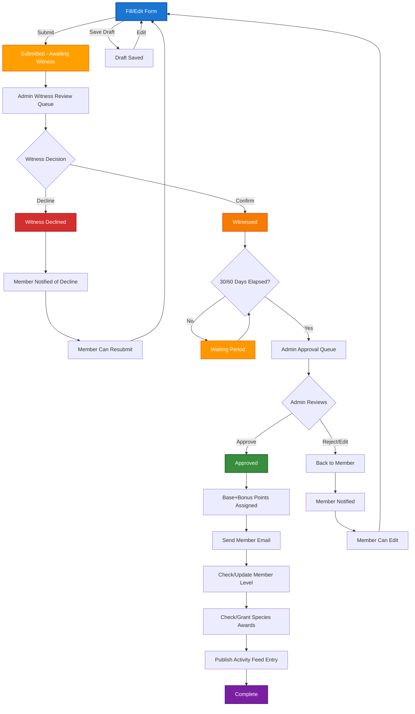

# Submission Workflow - Current vs Proposed Witnessed System

## Current Submission Workflow


## Proposed Witnessed Submission Workflow



## State Definitions

| State | Database Fields | Description |
|-------|----------------|-------------|
| **Draft** | `submitted_on: NULL` | User is filling/editing form, not submitted |
| **Submitted - Awaiting Witness** | `submitted_on: datetime`<br>`witnessed_by: NULL`<br>`witness_verification_status: 'pending'` | Submitted and waiting for any admin to witness the spawn/propagation |
| **Witnessed & Confirmed** | `witnessed_by: member_id`<br>`witnessed_on: datetime`<br>`witness_verification_status: 'confirmed'` | Witness has confirmed the spawn/propagation, waiting for time period |
| **Waiting Period** | Same as Witnessed | Waiting for 30/60 days from reproduction_date before admin approval |
| **Witness Declined** | `witness_verification_status: 'declined'` | Witness declined to verify, member can resubmit |
| **Approved** | `approved_by: member_id`<br>`approved_on: datetime`<br>`points: number` | Admin approved witnessed submission and assigned points |
| **Complete** | All approval fields set | Fully processed with points, emails, level checks, awards, and activity feed |

## State Transitions

### 1. Form Filling → Draft or Submission
**Trigger**: User clicks "Save Draft" or "Submit" button
**Requirements**:
- Save Draft: Basic fields (member, species name)
- Submit: All required fields completed and validated
**Side Effects**:
- Save Draft: Store form data, keep `submitted_on` NULL
- Submit: Set `submitted_on`, set `witness_verification_status='pending'`, add to admin witness queue

### 2. Submitted → Witnessed & Confirmed
**Trigger**: Any admin clicks "Confirm Witness" in admin witness review queue
**Requirements**: Admin member reviewing submission, verifying spawn/propagation occurred
**Side Effects**:
- Set `witnessed_by` to admin member ID who confirmed
- Set `witnessed_on` timestamp
- Set `witness_verification_status` to 'confirmed'
- Send confirmation email to member
- Enter waiting period (check if 30/60 days have elapsed from reproduction_date)

### 3. Submitted → Witness Declined
**Trigger**: Admin clicks "Decline Witness" in admin witness review queue
**Requirements**: Admin member reviewing submission, unable to verify spawn/propagation
**Side Effects**:
- Set `witness_verification_status` to 'declined'
- Set `witnessed_by` to admin member ID who declined (for tracking)
- Send decline notification to member with reason
- Remove from witness queue
- Allow member to edit and resubmit

### 4. Witnessed & Confirmed → Waiting Period → Admin Approval Queue
**Trigger**: Automatic check based on reproduction_date + required waiting period
**Requirements**: 
- 30 days for fish/inverts/corals
- 60 days for plants (to ensure successful propagation)
**Side Effects**:
- If waiting period complete: Move to admin approval queue
- If waiting period incomplete: Remain in waiting period, check daily

### 5. Waiting Period Complete → Approved
**Trigger**: Admin clicks "Approve" in approval queue
**Requirements**: Admin role, submission witnessed + waiting period elapsed
**Side Effects**:
- Set `approved_by` and `approved_on` timestamps
- Assign base `points` and calculate bonus points
- Link to canonical species name (`species_name_id`)
- Trigger post-approval workflow

### 6. Approved → Complete
**Trigger**: Automatic after approval processing
**Requirements**: Approval has been successfully processed
**Side Effects**:
- Send approval email to member
- Check and update member levels
- Check and grant specialty awards
- Create activity feed entry
- Mark submission as fully processed

### 7. Error/Reject States → Back to Form
**Trigger**: Admin rejects, witness declines, or validation errors
**Requirements**: Varies by rejection reason
**Side Effects**:
- Send notification to member explaining issue
- Reset appropriate timestamps and status fields
- Allow member to edit and resubmit

## Admin Interfaces Required

### 1. Admin Witness Review Queue
- **URL**: `/admin/witness-queue`
- **Shows**: All submissions with `witness_verification_status = 'pending'` for the admin's programs
- **Actions**: Confirm Witness, Decline Witness, View Submission Details
- **Information**: Member name, species, reproduction date, tank details, photos
- **Filters**: By program, date range, member name

### 2. Waiting Period Monitor
- **URL**: `/admin/waiting-period`
- **Shows**: Witnessed submissions waiting for time period to elapse
- **Information**: Days remaining until eligible for approval
- **Filters**: By program, time remaining, reproduction date

### 3. Approval Queue (Updated)
- **URL**: `/admin/approval-queue`
- **Shows**: Submissions with `witness_verification_status = 'confirmed'` AND waiting period elapsed AND `approved_on IS NULL`
- **Actions**: Approve, Reject, Edit
- **Changes**: Only witnessed submissions that have completed waiting period

### 4. Witness Management
- **URL**: `/admin/witnesses`
- **Shows**: List of admin members who can witness
- **Actions**: Enable/disable witness privileges
- **Stats**: Witness activity and response times

## Email Notifications

### 1. Witness Confirmation
**To**: Submitting member
**When**: Admin confirms witness in review queue
**Content**: Admin [Name] has confirmed your spawn/propagation, submission moved to waiting period

### 2. Witness Decline
**To**: Submitting member
**When**: Admin declines witness in review queue
**Content**: Reason for decline, instructions to resubmit with corrections

### 3. Approval (Updated)
**To**: Submitting member
**When**: Admin approves witnessed submission
**Content**: Points awarded, witness acknowledgment

## Database Schema Changes

```sql
-- Migration 009: Add witness fields
ALTER TABLE submissions ADD COLUMN witnessed_by INTEGER REFERENCES members(id);
ALTER TABLE submissions ADD COLUMN witnessed_on DATETIME;
ALTER TABLE submissions ADD COLUMN witness_verification_status TEXT
    CHECK (witness_verification_status IN ('pending', 'confirmed', 'declined'))
    DEFAULT 'pending';

-- Index for witness queries
CREATE INDEX idx_submissions_witness_status ON submissions (witness_verification_status);
CREATE INDEX idx_submissions_witnessed_by ON submissions (witnessed_by);
```

## Form Changes

### Submission Form Updates
- **No witness fields needed**: Witness assignment happens during admin review
- **UI Message**: Clear indication that admin witness verification will be required
- **Validation**: Standard form validation, no witness-specific requirements

### Admin Forms
- **Witness Review Queue**: Interface for any admin to confirm/decline witness verification
- **Waiting Period Monitor**: Track submissions in waiting period with days remaining
- **Approval Queue**: Updated to only show witnessed submissions past waiting period
- **Action Buttons**: "Confirm Witness" and "Decline Witness" with reason fields
